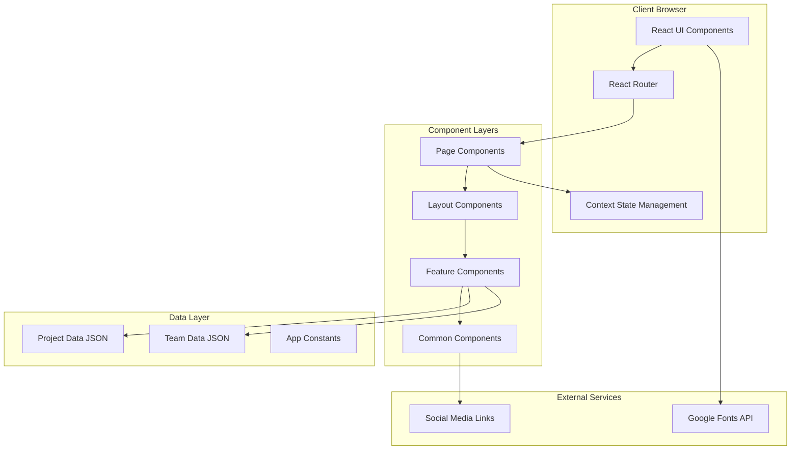
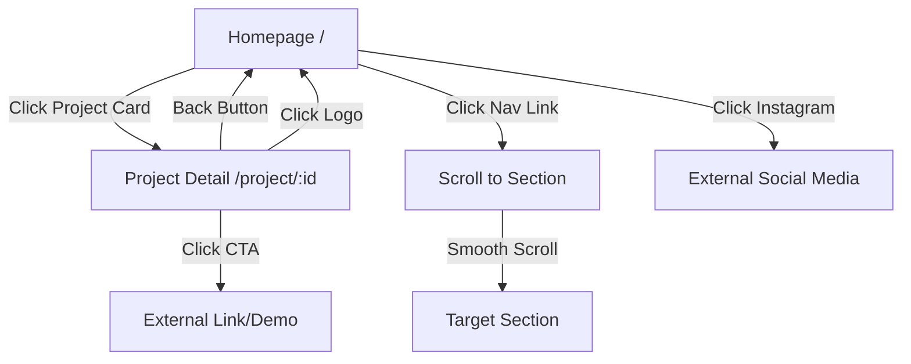

# Design Document: Xolvon Comprehensive Marketplace Website

## Overview

### Purpose

The Xolvon Comprehensive Marketplace Website is a digital platform designed to showcase the 18 projects within the ProjectXolvon ecosystem. It serves as a centralized marketplace where visitors can discover, explore, and engage with various Human-AI solutions ranging from content automation tools to business intelligence systems.

### System Positioning

This website positions Xolvon as a "67 Alpha-stage Digital Production Lab" focused on "Human-AI End-to-End Attention Systems" that solve society's complex problems through data-driven solutions.

### Core User Journeys

1. **Discovery Journey**: Visitor lands on homepage → Views hero section with value proposition → Scrolls to marketplace grid → Browses 18 project cards
2. **Exploration Journey**: Clicks on project card → Navigates to project detail page → Reviews features and benefits → Engages with CTA
3. **Trust Building Journey**: Views achievement metrics → Reads about capabilities and pillars → Reviews team section with bios
4. **Engagement Journey**: Clicks primary CTA → Accesses contact form → Submits inquiry → Follows social media

### Technical Approach

The website will be built as a modern React-based Single Page Application (SPA) using:
- **Frontend Framework**: React 19 with TypeScript
- **Build Tool**: Vite for fast development and optimized production builds
- **Styling**: TailwindCSS 4 for utility-first responsive design
- **Routing**: React Router DOM for client-side navigation
- **Animation**: Motion (Framer Motion) for smooth transitions and scroll animations
- **State Management**: React Context API for global state (theme, navigation)
- **Icons**: Lucide React for consistent iconography


## Architecture

### High-Level System Architecture



### Architecture Principles

1. **Component-Based Architecture**: Modular, reusable components following single responsibility principle
2. **Responsive-First Design**: Mobile-first approach with progressive enhancement for larger screens
3. **Static Data Model**: Project and team data stored as JSON/TypeScript constants (no backend required for MVP)
4. **Client-Side Routing**: Fast navigation without full page reloads
5. **Performance Optimization**: Code splitting, lazy loading, image optimization
6. **Accessibility Compliance**: WCAG AA standards with semantic HTML and ARIA attributes

### Deployment Architecture

- **Hosting**: Static site hosting (Cloudflare Pages, Vercel, or Netlify)
- **Build Process**: Vite production build generates optimized static assets
- **CDN**: Automatic CDN distribution for global performance
- **SSL**: HTTPS by default through hosting provider


## Components and Interfaces

### Component Hierarchy

```
App (Root)
├── Router Configuration
│   ├── HomePage
│   │   ├── NavigationBar
│   │   ├── HeroSection
│   │   ├── MetricsDisplay
│   │   ├── MarketplaceGrid
│   │   │   └── ProjectCard (×18)
│   │   ├── CapabilitiesModule
│   │   │   └── CapabilityCard (×6)
│   │   ├── ThreePillarsSection
│   │   │   └── PillarCard (×3)
│   │   ├── AboutSection
│   │   ├── TargetAudiencesSection
│   │   ├── TeamSection
│   │   │   └── TeamMemberCard (×6)
│   │   └── Footer
│   │
│   └── ProjectDetailPage
│       ├── NavigationBar
│       ├── ProjectHeroSection
│       ├── ProjectDescription
│       ├── ProjectFeatures
│       ├── ProjectCTA
│       └── Footer
│
└── Common Components
    ├── Button
    ├── Card
    ├── Section
    ├── Heading
    └── Image
```


### Core Component Specifications

#### NavigationBar Component

**Purpose**: Fixed navigation header with responsive hamburger menu

**Props Interface**:
```typescript
interface NavigationBarProps {
  transparent?: boolean;
  className?: string;
}
```

**Responsibilities**:
- Display Xolvon logo/text on left
- Render navigation links (Home, Projects, Team, Contact)
- Toggle hamburger menu on mobile (<768px)
- Apply scroll effects (background change on scroll)
- Highlight active section
- Remain fixed at viewport top

**State**:
- `isMenuOpen: boolean` - Hamburger menu toggle state
- `activeSection: string` - Current active section for highlighting


#### HeroSection Component

**Purpose**: Primary landing section with headline, tagline, and CTA

**Props Interface**:
```typescript
interface HeroSectionProps {
  headline: string;
  tagline: string;
  ctaText: string;
  ctaAction: () => void;
  description?: string;
}
```

**Responsibilities**:
- Display h1 headline (e.g., "67 Alpha-stage Digital Production Lab")
- Show tagline describing marketplace
- Render primary CTA button
- Occupy 80% viewport height on desktop, 60% on mobile
- Include brief description text
- Render within 3 seconds or show loading fallback


#### MetricsDisplay Component

**Purpose**: Showcase achievement metrics with animated counters

**Props Interface**:
```typescript
interface Metric {
  value: string;
  label: string;
}

interface MetricsDisplayProps {
  metrics: Metric[];
  animationDuration?: number;
}
```

**Responsibilities**:
- Display 6 metrics: "45+ field experiments shipped", "120 reusable playbooks", "1.4k+ automation hours/mo", "2.7M/mo real-time signals", "420+ data assets", "~38s avg response"
- Animate numeric values from 0 to target over 2 seconds when entering viewport
- Handle scroll away gracefully (continue animation)
- Display final values without re-animation on scroll back
- Use Intersection Observer API for viewport detection


#### ProjectCard Component

**Purpose**: Marketplace card for individual projects with hover effects

**Props Interface**:
```typescript
interface ProjectCardProps {
  project: Project;
  onClick: (projectId: string) => void;
}
```

**Responsibilities**:
- Display project title, thumbnail, and short description (50-150 chars)
- Apply hover effects (shadow increase, scale, border highlight) within 300ms
- Navigate to project detail page on click
- Maintain responsive image aspect ratio
- Include fallback for failed image loads


#### MarketplaceGrid Component

**Purpose**: Responsive grid layout for 18 project cards

**Props Interface**:
```typescript
interface MarketplaceGridProps {
  projects: Project[];
  onProjectClick: (projectId: string) => void;
}
```

**Responsibilities**:
- Display 18 ProjectCard components in responsive grid
- Desktop (≥1024px): 3 columns
- Tablet (768-1024px): 2 columns
- Mobile (<768px): 1 column
- Maintain consistent spacing and alignment


#### TeamMemberCard Component

**Purpose**: Display team member information with Instagram bio

**Props Interface**:
```typescript
interface TeamMemberCardProps {
  member: TeamMember;
}
```

**Responsibilities**:
- Display name, role, profile image, and bio (50-300 chars)
- Show placeholder image or initials if image fails to load
- Display "Bio not available" if bio is missing
- Apply responsive typography
- Include Instagram bio verbatim


#### Button Component

**Purpose**: Reusable button with variant styles

**Props Interface**:
```typescript
interface ButtonProps {
  variant: 'primary' | 'secondary' | 'outline';
  size: 'sm' | 'md' | 'lg';
  children: React.ReactNode;
  onClick?: () => void;
  className?: string;
  disabled?: boolean;
}
```

**Responsibilities**:
- Apply brand color palette based on variant
- Provide hover effects within 200ms
- Maintain minimum touch target size (44×44px)
- Use Poppins font weight 600-700
- Support keyboard navigation and focus states


## Data Models

### Project Data Model

```typescript
interface Project {
  id: string; // Kebab-case identifier (e.g., "mulai-ai")
  title: string; // Display name (e.g., "mulai.ai")
  category: ProjectCategory;
  shortDescription: string; // 50-150 characters for card display
  longDescription: string; // 200+ characters for detail page
  features: string[]; // At least 3 key features
  thumbnailUrl: string; // Card image URL
  heroImageUrl: string; // Detail page banner
  ctaText: string; // CTA button text
  ctaLink: string; // External link or demo URL
  tags: string[]; // Technology tags (e.g., ["AI", "Education", "SaaS"])
  launchNumber: number; // Alpha launch order (1-18)
  status: ProjectStatus;
}

enum ProjectCategory {
  AI_LEARNING = "AI Learning",
  BUSINESS_OPTIMIZATION = "Business Optimization",
  CONTENT_AUTOMATION = "Content Automation",
  DATA_INTELLIGENCE = "Data Intelligence",
  CONSUMER_ANALYSIS = "Consumer Analysis",
  CYBER_DEFENSE = "Cyber Defense",
  UMKM_EMPOWERMENT = "UMKM Empowerment"
}

enum ProjectStatus {
  ALPHA = "Alpha",
  PRE_MVP = "Pre-MVP",
  LAUNCHED = "Launched"
}
```


### Team Member Data Model

```typescript
interface TeamMember {
  id: string; // Unique identifier
  name: string; // Full name
  role: string; // Primary role title
  bio: string; // Instagram bio (50-300 characters)
  expertise: string; // Expertise area from Instagram
  university: string; // University abbreviation
  major: string; // Study major
  profileImageUrl: string; // Profile photo URL
  instagramHandle?: string; // Optional Instagram username
}
```

### Example Team Data:

```typescript
const teamMembers: TeamMember[] = [
  {
    id: "farsya-hasibuan",
    name: "M. Farsya Hasibuan",
    role: "Founder & Project Lead",
    bio: "Finance, Data Science & Cyber - UPNVJ | Data Science",
    expertise: "Finance, Data Science & Cyber",
    university: "UPNVJ",
    major: "Data Science",
    profileImageUrl: "/images/team/farsya.jpg",
    instagramHandle: "projectxolvon"
  },
  // ... 5 more team members
];
```


### Capability Data Model

```typescript
interface Capability {
  id: string;
  title: string; // One of: Attention Alert, Real-Time Sentiment Analysis, Cyber Defense, Xolvon Market, Human-AI Attention-Data Insight, Attention Boost
  description: string; // 50-300 characters
  iconName: string; // Lucide icon name
  color: string; // Brand color (purple/blue)
}
```

### Pillar Data Model

```typescript
interface Pillar {
  id: string;
  title: string; // "Impact-Driven Automation", "Human-AI Collaboration", or "Scalable B2B Solutions"
  description: string; // At least 100 characters
  iconName: string;
}
```

### Metric Data Model

```typescript
interface Metric {
  id: string;
  value: string; // Display value (e.g., "45+", "1.4k+", "~38s")
  numericValue: number; // Numeric value for animation
  unit?: string; // Optional unit (e.g., "mo", "s")
  label: string; // Description text
}
```


### Routing Data Model

```typescript
interface Route {
  path: string;
  component: React.ComponentType;
  exact?: boolean;
}

const routes: Route[] = [
  {
    path: "/",
    component: HomePage,
    exact: true
  },
  {
    path: "/project/:projectId",
    component: ProjectDetailPage,
    exact: true
  }
];
```

### Design Token System

```typescript
interface DesignTokens {
  colors: {
    purple: {
      primary: "#6B21A8";    // Purple 800
      secondary: "#9333EA";  // Purple 600
      light: "#C084FC";      // Purple 400
    };
    blue: {
      primary: "#0EA5E9";    // Sky 500
      secondary: "#3B82F6";  // Blue 500
      light: "#60A5FA";      // Blue 400
    };
    neutral: {
      black: "#000000";
      darkGray: "#1F2937";   // Gray 800
      gray: "#6B7280";       // Gray 500
      lightGray: "#F3F4F6";  // Gray 100
      white: "#FFFFFF";
    };
  };
  typography: {
    fontFamily: "Poppins, system-ui, sans-serif";
    weights: {
      regular: 400;
      medium: 500;
      semibold: 600;
      bold: 700;
      extrabold: 800;
      black: 900;
    };
    sizes: {
      body: "16px";
      h1: "48px"; // Desktop
      h2: "36px";
      h3: "28px";
      button: "16px";
    };
  };
  spacing: {
    xs: "4px";
    sm: "8px";
    md: "16px";
    lg: "24px";
    xl: "32px";
    "2xl": "48px";
    "3xl": "64px";
  };
  breakpoints: {
    mobile: "0px";
    tablet: "768px";
    desktop: "1024px";
  };
}
```


## Error Handling

### Image Loading Errors

**Strategy**: Graceful degradation with placeholders

**Implementation**:
- Use `onError` handler on `` elements
- Display placeholder image or colored background with initials
- Log errors to console for debugging
- Provide alt text for accessibility

**Example**:
```typescript
const handleImageError = (e: React.SyntheticEvent<HTMLImageElement>) => {
  e.currentTarget.src = '/images/placeholder.png';
  console.error('Failed to load image:', e.currentTarget.dataset.originalSrc);
};
```

### Navigation Errors

**Strategy**: Fallback routing and error boundaries

**Implementation**:
- Implement React Error Boundary for component-level errors
- Provide 404 page for invalid routes
- Show user-friendly error messages
- Include "Return to Home" button

### Performance Degradation

**Strategy**: Progressive enhancement with loading states

**Implementation**:
- Show loading spinners for delayed content (>3 seconds)
- Display "Content is loading, please wait" message in Hero Section if slow
- Use skeleton screens for anticipated content
- Implement timeout fallbacks


### Network Errors

**Strategy**: Retry mechanisms and offline awareness

**Implementation**:
- Detect network connectivity status
- Show offline indicator when disconnected
- Queue external link clicks for retry
- Cache static assets with Service Worker (future enhancement)

### Form Validation Errors

**Strategy**: Real-time validation with clear feedback

**Implementation**:
- Validate email format using regex
- Show inline error messages below form fields
- Disable submit button until validation passes
- Provide success confirmation after submission

### Accessibility Errors

**Strategy**: Semantic HTML and ARIA attributes

**Implementation**:
- Use proper heading hierarchy (h1-h6)
- Include ARIA labels for custom components
- Provide keyboard navigation support
- Test with screen readers during development


## Testing Strategy

### Overview

Since this is a UI-focused website project with primarily rendering and interaction concerns, **property-based testing is NOT applicable**. The testing strategy will focus on unit tests for component logic, snapshot tests for UI consistency, integration tests for user flows, and manual accessibility testing.

### Unit Testing

**Scope**: Component logic, utility functions, data transformations

**Framework**: Vitest + React Testing Library

**Test Categories**:

1. **Component Rendering Tests**
   - Verify components render with correct props
   - Test conditional rendering based on viewport size
   - Validate default prop values

2. **Interaction Tests**
   - Test button click handlers
   - Verify navigation link behavior
   - Test hamburger menu toggle
   - Validate form input handling

3. **State Management Tests**
   - Test Context providers
   - Verify state updates
   - Test custom hooks

**Example Test Cases**:
- NavigationBar displays logo and links
- HeroSection renders headline as h1 element
- ProjectCard triggers onClick when clicked
- MetricsDisplay animates values from 0 to target
- Button applies correct variant styles
- TeamMemberCard displays placeholder on image error


### Snapshot Testing

**Scope**: UI consistency and regression detection

**Framework**: Vitest + React Testing Library

**Strategy**:
- Create snapshots of major components
- Update snapshots when intentional design changes occur
- Review snapshot diffs during code review

**Components for Snapshot Testing**:
- HeroSection
- ProjectCard
- TeamMemberCard
- Button variants
- Footer
- Complete HomePage layout

### Integration Testing

**Scope**: User journeys and routing

**Framework**: Playwright or Cypress

**Test Scenarios**:

1. **Discovery Journey**
   - Load homepage
   - Verify Hero Section visible within 3 seconds
   - Scroll to Marketplace Grid
   - Verify 18 project cards displayed
   - Check responsive grid layout (3/2/1 columns)

2. **Navigation Flow**
   - Click project card
   - Navigate to Project Detail Page
   - Verify project data displayed
   - Click back button
   - Return to homepage

3. **Responsive Behavior**
   - Test at mobile viewport (375px)
   - Verify single-column layouts
   - Test hamburger menu toggle
   - Test at tablet viewport (768px)
   - Verify 2-column grids
   - Test at desktop viewport (1280px)
   - Verify 3-column grids


4. **CTA and Forms**
   - Click primary CTA button
   - Navigate to contact form
   - Validate form fields (name, email required)
   - Submit form and verify success message

5. **Social Media Links**
   - Click Instagram link in footer
   - Verify opens in new tab
   - Verify correct URL (https://www.instagram.com/projectxolvon)

### Visual Regression Testing

**Scope**: Design consistency across browsers and devices

**Tool**: Percy or Chromatic (optional, recommended for production)

**Strategy**:
- Capture baseline screenshots of all pages
- Compare new screenshots against baseline
- Flag visual differences for review
- Test across Chrome, Firefox, Safari

### Accessibility Testing

**Scope**: WCAG AA compliance

**Approach**: Manual testing with assistive technologies

**Test Areas**:

1. **Keyboard Navigation**
   - Tab through all interactive elements
   - Verify focus indicators visible
   - Test Escape key to close hamburger menu
   - Verify tab order follows reading flow

2. **Screen Reader Testing**
   - Test with NVDA (Windows) or VoiceOver (Mac)
   - Verify alt text for images
   - Check ARIA labels announced correctly
   - Validate heading hierarchy

3. **Color Contrast**
   - Use axe DevTools or WAVE extension
   - Verify 4.5:1 ratio for normal text
   - Verify 3:1 ratio for large text
   - Test with color blindness simulators

4. **Text Scaling**
   - Zoom to 200% using browser zoom
   - Verify no horizontal scrolling at 1280px width
   - Check no content overlap or clipping


### Performance Testing

**Scope**: Loading speed and optimization

**Tools**: Lighthouse, WebPageTest

**Metrics**:
- First Contentful Paint (FCP): < 1.8s
- Largest Contentful Paint (LCP): < 2.5s
- Time to Interactive (TTI): < 3.0s
- Cumulative Layout Shift (CLS): < 0.1
- Total Blocking Time (TBT): < 200ms

**Test Scenarios**:
- Measure load time on 5 Mbps connection
- Verify Hero Section renders within 3 seconds
- Check image optimization (max 500KB per photo)
- Test lazy loading for below-fold images
- Validate code splitting effectiveness

### Test Coverage Goals

- Unit test coverage: ≥ 70% of component logic
- Integration test coverage: All critical user journeys
- Accessibility compliance: WCAG AA standards
- Performance: Lighthouse score ≥ 90

### Continuous Integration

**Strategy**:
- Run unit tests on every commit
- Run integration tests on pull requests
- Generate coverage reports
- Block merge if tests fail or coverage drops


## Responsive Design Strategy

### Breakpoint System

**Mobile First Approach**: Base styles for mobile, progressively enhanced for larger screens

```typescript
const breakpoints = {
  mobile: '0px',      // < 768px
  tablet: '768px',    // 768px - 1023px
  desktop: '1024px'   // ≥ 1024px
};
```

### Layout Patterns by Viewport

#### Mobile (<768px)

- **Navigation**: Hamburger menu, full-screen overlay
- **Grid Layouts**: Single column stacks
- **Hero Section**: 60% viewport height
- **Typography**: Scaled down (h1: 32px)
- **Touch Targets**: Minimum 44×44px
- **Images**: Full width, optimized resolution

#### Tablet (768px - 1023px)

- **Navigation**: Horizontal links visible
- **Grid Layouts**: 2 columns (projects, team, capabilities)
- **Hero Section**: 70% viewport height
- **Typography**: Medium scale (h1: 40px)
- **Spacing**: Increased padding

#### Desktop (≥1024px)

- **Navigation**: Full horizontal menu with logo
- **Grid Layouts**: 3 columns (projects), 2-3 columns (others)
- **Hero Section**: 80% viewport height
- **Typography**: Full scale (h1: 48px+)
- **Hover Effects**: Enabled for cards and buttons
- **Max Width**: Container max-width 1440px


### Responsive Component Behavior

#### NavigationBar

```typescript
// Mobile: Hidden links + Hamburger
<nav className="fixed top-0 w-full z-50">
  <div className="flex justify-between items-center">
    <Logo />
    <HamburgerButton onClick={toggleMenu} />
  </div>
  {isMenuOpen && <MobileMenu links={navLinks} />}
</nav>

// Desktop: Visible links
<nav className="fixed top-0 w-full z-50">
  <div className="flex justify-between items-center">
    <Logo />
    <ul className="flex space-x-8">
      {navLinks.map(link => <NavLink key={link.id} {...link} />)}
    </ul>
  </div>
</nav>
```

#### Grid Layouts (TailwindCSS)

```typescript
<div className="grid grid-cols-1 md:grid-cols-2 lg:grid-cols-3 gap-6">
  {items.map(item => <Card key={item.id} {...item} />)}
</div>
```

### Image Optimization Strategy

**Responsive Images**:
```html

```

**Format Strategy**:
- Use WebP with PNG/JPEG fallback
- Serve smaller images for mobile
- Apply lazy loading for below-fold images


## Color Palette & Typography System

### Brand Color Palette

**Primary Colors**:
```css
--purple-primary: #6B21A8;   /* Purple 800 - Primary CTAs, headings */
--purple-secondary: #9333EA; /* Purple 600 - Accents, hover states */
--purple-light: #C084FC;     /* Purple 400 - Highlights */

--blue-primary: #0EA5E9;     /* Sky 500 - Secondary CTAs, links */
--blue-secondary: #3B82F6;   /* Blue 500 - Info elements */
--blue-light: #60A5FA;       /* Blue 400 - Hover states */
```

**Neutral Colors**:
```css
--black: #000000;            /* Body text, nav background */
--gray-800: #1F2937;         /* Dark sections, footer */
--gray-500: #6B7280;         /* Secondary text */
--gray-100: #F3F4F6;         /* Light backgrounds */
--white: #FFFFFF;            /* Primary backgrounds */
```

### Color Application Rules

1. **Primary CTA Buttons**: Purple primary background, white text
2. **Secondary Buttons**: Blue primary background, white text
3. **Outline Buttons**: Purple/blue border, matching text color
4. **Body Text**: Black or gray-800 on white/light backgrounds
5. **Headings**: Purple primary or black depending on section
6. **Links**: Blue primary with blue secondary hover
7. **Navigation Bar**: White background with black text, transitions on scroll
8. **Footer**: Gray-800 background with gray-100 text
9. **Section Alternation**: White and gray-100 backgrounds


### Typography System

**Font Family**: Poppins (Google Fonts)

**Font Weights**:
```typescript
const fontWeights = {
  regular: 400,    // Body text
  medium: 500,     // Emphasized body text
  semibold: 600,   // Subheadings, buttons
  bold: 700,       // h3, h2, buttons
  extrabold: 800,  // h1, hero headlines
  black: 900       // Special emphasis (optional)
};
```

**Font Sizes (Desktop ≥1024px)**:
```css
--text-h1: 48px;      /* font-weight: 800 */
--text-h2: 36px;      /* font-weight: 700 */
--text-h3: 28px;      /* font-weight: 700 */
--text-body: 16px;    /* font-weight: 400 */
--text-body-lg: 18px; /* font-weight: 400 */
--text-button: 16px;  /* font-weight: 600 */
--text-small: 14px;   /* font-weight: 400 */
```

**Font Sizes (Mobile <768px)**:
```css
--text-h1: 32px;      /* Scaled down 33% */
--text-h2: 28px;
--text-h3: 24px;
--text-body: 16px;    /* Minimum 16px */
--text-body-lg: 18px;
--text-button: 16px;
--text-small: 14px;
```

**Line Heights**:
```css
--line-height-tight: 1.2;    /* Headings */
--line-height-normal: 1.5;   /* Body text */
--line-height-relaxed: 1.75; /* Reading content */
```


### Typography Implementation

**Component Examples**:

```typescript
// Heading Component
const Heading = ({ level, children, className }: HeadingProps) => {
  const Tag = `h${level}` as keyof JSX.IntrinsicElements;
  
  const styles = {
    1: "text-3xl md:text-5xl font-extrabold text-purple-800",
    2: "text-2xl md:text-4xl font-bold text-black",
    3: "text-xl md:text-3xl font-bold text-gray-800"
  };
  
  return <Tag className={cn(styles[level], className)}>{children}</Tag>;
};

// Body Text
<p className="text-base font-normal text-gray-800 leading-normal">
  {content}
</p>

// Button Text
<button className="text-base font-semibold">
  {ctaText}
</button>
```

**Font Loading Strategy**:

```html
<!-- index.html -->
<link rel="preconnect" href="https://fonts.googleapis.com">
<link rel="preconnect" href="https://fonts.gstatic.com" crossorigin>
<link href="https://fonts.googleapis.com/css2?family=Poppins:wght@400;500;600;700;800;900&display=swap" rel="stylesheet">
```

**Fallback Stack**:
```css
font-family: 'Poppins', system-ui, -apple-system, 'Segoe UI', sans-serif;
```


## State Management Approach

### Context API Structure

Since this is a relatively simple website with limited global state needs, we'll use React Context API rather than a full state management library like Redux.

**Global State Requirements**:
1. Navigation menu open/closed state (mobile)
2. Active section for navigation highlighting
3. Theme configuration (future: dark mode support)
4. Project data cache

### Context Providers

#### NavigationContext

```typescript
interface NavigationContextType {
  isMenuOpen: boolean;
  toggleMenu: () => void;
  closeMenu: () => void;
  activeSection: string;
  setActiveSection: (section: string) => void;
}

const NavigationContext = createContext<NavigationContextType | undefined>(undefined);

export const NavigationProvider: React.FC<{ children: React.ReactNode }> = ({ children }) => {
  const [isMenuOpen, setIsMenuOpen] = useState(false);
  const [activeSection, setActiveSection] = useState('home');
  
  const toggleMenu = () => setIsMenuOpen(prev => !prev);
  const closeMenu = () => setIsMenuOpen(false);
  
  return (
    <NavigationContext.Provider value={{
      isMenuOpen,
      toggleMenu,
      closeMenu,
      activeSection,
      setActiveSection
    }}>
      {children}
    </NavigationContext.Provider>
  );
};
```


#### ProjectDataContext

```typescript
interface ProjectDataContextType {
  projects: Project[];
  getProjectById: (id: string) => Project | undefined;
  projectsByCategory: Record<ProjectCategory, Project[]>;
}

const ProjectDataContext = createContext<ProjectDataContextType | undefined>(undefined);

export const ProjectDataProvider: React.FC<{ children: React.ReactNode }> = ({ children }) => {
  const projects = projectsData; // Imported from data file
  
  const getProjectById = (id: string) => projects.find(p => p.id === id);
  
  const projectsByCategory = projects.reduce((acc, project) => {
    if (!acc[project.category]) acc[project.category] = [];
    acc[project.category].push(project);
    return acc;
  }, {} as Record<ProjectCategory, Project[]>);
  
  return (
    <ProjectDataContext.Provider value={{
      projects,
      getProjectById,
      projectsByCategory
    }}>
      {children}
    </ProjectDataContext.Provider>
  );
};
```

### Custom Hooks

```typescript
// useNavigation hook
export const useNavigation = () => {
  const context = useContext(NavigationContext);
  if (!context) throw new Error('useNavigation must be used within NavigationProvider');
  return context;
};

// useProjects hook
export const useProjects = () => {
  const context = useContext(ProjectDataContext);
  if (!context) throw new Error('useProjects must be used within ProjectDataProvider');
  return context;
};

// useScrollSpy hook for active section detection
export const useScrollSpy = (sectionIds: string[]) => {
  const [activeSection, setActiveSection] = useState(sectionIds[0]);
  
  useEffect(() => {
    const observer = new IntersectionObserver(
      (entries) => {
        entries.forEach((entry) => {
          if (entry.isIntersecting) {
            setActiveSection(entry.target.id);
          }
        });
      },
      { threshold: 0.5 }
    );
    
    sectionIds.forEach((id) => {
      const element = document.getElementById(id);
      if (element) observer.observe(element);
    });
    
    return () => observer.disconnect();
  }, [sectionIds]);
  
  return activeSection;
};
```


## Routing & Navigation Flow

### Route Structure

```typescript
// App.tsx
import { BrowserRouter, Routes, Route } from 'react-router-dom';

function App() {
  return (
    <BrowserRouter>
      <Routes>
        <Route path="/" element={<HomePage />} />
        <Route path="/project/:projectId" element={<ProjectDetailPage />} />
        <Route path="*" element={<NotFoundPage />} />
      </Routes>
    </BrowserRouter>
  );
}
```

### Navigation Flow Diagram



### Scroll Behavior

**Smooth Scroll Implementation**:

```typescript
const scrollToSection = (sectionId: string) => {
  const element = document.getElementById(sectionId);
  if (element) {
    element.scrollIntoView({
      behavior: 'smooth',
      block: 'start'
    });
  }
};

// NavLink component
<a 
  href={`#${section.id}`}
  onClick={(e) => {
    e.preventDefault();
    scrollToSection(section.id);
    closeMenu(); // Close mobile menu after click
  }}
  className="nav-link"
>
  {section.label}
</a>
```


### Project Navigation

**Detail Page Navigation**:

```typescript
// ProjectCard.tsx
const ProjectCard = ({ project }: ProjectCardProps) => {
  const navigate = useNavigate();
  
  const handleClick = () => {
    navigate(`/project/${project.id}`);
  };
  
  return (
    <div onClick={handleClick} className="project-card cursor-pointer">
      {/* Card content */}
    </div>
  );
};

// ProjectDetailPage.tsx
const ProjectDetailPage = () => {
  const { projectId } = useParams<{ projectId: string }>();
  const { getProjectById } = useProjects();
  const navigate = useNavigate();
  
  const project = getProjectById(projectId);
  
  if (!project) {
    return <NotFoundPage />;
  }
  
  const handleBack = () => {
    navigate(-1); // Go back to previous page
  };
  
  return (
    <div>
      <button onClick={handleBack}>← Back to Projects</button>
      {/* Project detail content */}
    </div>
  );
};
```


## API/Data Integration Patterns

### Static Data Approach (MVP)

For the initial launch, all data will be statically defined in TypeScript files. This approach is sufficient because:
1. Project data changes infrequently
2. No user-generated content
3. No real-time updates required
4. Faster load times (no API calls)
5. Simpler deployment (no backend)

### Data File Structure

```
src/
  data/
    projects.ts          # 18 project definitions
    team.ts              # 6 team member definitions
    capabilities.ts      # 6 capability definitions
    pillars.ts           # 3 pillar definitions
    metrics.ts           # 6 metric definitions
    constants.ts         # App-wide constants
```

### Example Data Files

**projects.ts**:
```typescript
export const projects: Project[] = [
  {
    id: "mulai-ai",
    title: "mulai.ai",
    category: ProjectCategory.AI_LEARNING,
    shortDescription: "AI-assisted learning system & awareness platform untuk IT education",
    longDescription: "mulai.ai adalah Alpha Project pertama ProjectXolvon yang berfokus pada membangun awareness tentang kesiapan dan gambaran dunia IT melalui project basic Web, ML, AI, dan Data Science. Platform ini hadir untuk membantu pelajar dan mahasiswa memiliki bayangan yang lebih realistis sebelum melangkah lebih jauh ke dunia kuliah, kerja, dan kontribusi teknologi.",
    features: [
      "Integrated Curriculum System",
      "Adaptive Quiz & Evaluation",
      "Structured Prompting Framework",
      "Contextual AI Learning"
    ],
    thumbnailUrl: "/images/projects/mulai-ai-thumb.webp",
    heroImageUrl: "/images/projects/mulai-ai-hero.webp",
    ctaText: "Visit mulai.ai",
    ctaLink: "https://mulai-ai.pages.dev",
    tags: ["AI", "Education", "Learning Platform"],
    launchNumber: 1,
    status: ProjectStatus.LAUNCHED
  },
  // ... 17 more projects
];
```


**team.ts**:
```typescript
export const teamMembers: TeamMember[] = [
  {
    id: "farsya-hasibuan",
    name: "M. Farsya Hasibuan",
    role: "Founder & Project Lead",
    bio: "Finance, Data Science & Cyber - UPNVJ | Data Science",
    expertise: "Finance, Data Science & Cyber",
    university: "UPNVJ",
    major: "Data Science",
    profileImageUrl: "/images/team/farsya.jpg",
    instagramHandle: "projectxolvon"
  },
  {
    id: "zaidan-daffa",
    name: "Zaidan Daffa Abdillah",
    role: "Head of Tech & Experience",
    bio: "Web Dev & Experience - Tel-U | Informatics Engineering",
    expertise: "Web Dev & Experience",
    university: "Tel-U",
    major: "Informatics Engineering",
    profileImageUrl: "/images/team/zaidan.jpg"
  },
  {
    id: "varisha-aira",
    name: "Varisha Aira Dalimunthe",
    role: "Head of Community Ops",
    bio: "Ops & Legal - UPNVJ | Information System",
    expertise: "Ops & Legal",
    university: "UPNVJ",
    major: "Information System",
    profileImageUrl: "/images/team/varisha.jpg"
  },
  {
    id: "mahathir-abitah",
    name: "Mahathir Abitah Batubara",
    role: "Head of Business Dev",
    bio: "Product & BizDev - UNESA | Digital Business",
    expertise: "Product & BizDev",
    university: "UNESA",
    major: "Digital Business",
    profileImageUrl: "/images/team/mahathir.jpg"
  },
  {
    id: "laksmi-dewi",
    name: "I Gusti Ayu Laksmi Dewi",
    role: "Head of Attention Strategist",
    bio: "Social Media Specialist - UMN | Marketing Communication",
    expertise: "Social Media Specialist",
    university: "UMN",
    major: "Marketing Communication",
    profileImageUrl: "/images/team/laksmi.jpg"
  },
  {
    id: "khalifa-ghizzan",
    name: "Khalifa Ghizzan Moreno",
    role: "Head of Brand Strategist",
    bio: "PR & Communication - Tel-U | Communication Science",
    expertise: "PR & Communication",
    university: "Tel-U",
    major: "Communication Science",
    profileImageUrl: "/images/team/khalifa.jpg"
  }
];
```


### Future Backend Integration (Phase 2)

If dynamic data becomes necessary, the architecture supports easy migration to a backend:

**Potential Backend Scenarios**:
1. User authentication for project access
2. Analytics tracking for project views
3. Contact form submissions
4. Newsletter subscriptions
5. Admin CMS for updating project data

**API Design Pattern**:

```typescript
// services/api.ts
interface ApiClient {
  getProjects: () => Promise<Project[]>;
  getProjectById: (id: string) => Promise<Project>;
  submitContactForm: (data: ContactFormData) => Promise<void>;
}

// Example implementation with fetch
export const apiClient: ApiClient = {
  async getProjects() {
    const response = await fetch('/api/projects');
    if (!response.ok) throw new Error('Failed to fetch projects');
    return response.json();
  },
  
  async getProjectById(id: string) {
    const response = await fetch(`/api/projects/${id}`);
    if (!response.ok) throw new Error('Project not found');
    return response.json();
  },
  
  async submitContactForm(data: ContactFormData) {
    const response = await fetch('/api/contact', {
      method: 'POST',
      headers: { 'Content-Type': 'application/json' },
      body: JSON.stringify(data)
    });
    if (!response.ok) throw new Error('Form submission failed');
  }
};
```

**Data Fetching with React Query (Optional)**:

```typescript
import { useQuery } from '@tanstack/react-query';

export const useProjectsQuery = () => {
  return useQuery({
    queryKey: ['projects'],
    queryFn: apiClient.getProjects,
    staleTime: 5 * 60 * 1000, // 5 minutes
  });
};
```

For MVP, these patterns remain unimplemented, but the component structure supports easy integration when needed.


## Implementation Roadmap

### Phase 1: Foundation Setup (Week 1)

**Objectives**: Project scaffolding and core infrastructure

**Tasks**:
1. Initialize Vite + React + TypeScript project
2. Configure TailwindCSS with custom theme
3. Set up project structure (components, pages, data, utils)
4. Configure React Router
5. Implement design token system
6. Set up Poppins font loading
7. Create base layout components (NavigationBar, Footer)

**Deliverables**:
- Working dev environment
- Basic routing structure
- Brand colors and typography applied

### Phase 2: Homepage Development (Week 2)

**Objectives**: Build all homepage sections

**Tasks**:
1. Implement HeroSection with CTA
2. Build MetricsDisplay with animation
3. Create ProjectCard and MarketplaceGrid
4. Develop CapabilitiesModule (6 cards)
5. Build ThreePillarsSection (3 cards)
6. Implement AboutSection
7. Create TeamSection (6 members)
8. Implement responsive navigation

**Deliverables**:
- Fully functional homepage
- All 18 project cards displayed
- Responsive layout working


### Phase 3: Project Detail Pages (Week 3)

**Objectives**: Create individual project pages

**Tasks**:
1. Design ProjectDetailPage layout
2. Implement project hero section
3. Create features showcase component
4. Add project CTA section
5. Populate all 18 project data entries
6. Test navigation flow (home ↔ detail)
7. Optimize image loading

**Deliverables**:
- 18 unique project detail pages
- Smooth navigation between pages
- All project data complete

### Phase 4: Polish & Optimization (Week 4)

**Objectives**: Performance, accessibility, and final touches

**Tasks**:
1. Optimize images (WebP, responsive sizes)
2. Implement lazy loading
3. Add scroll animations with Motion
4. Test keyboard navigation
5. Run accessibility audit (axe DevTools)
6. Optimize Lighthouse scores
7. Add loading states and error boundaries
8. Test across devices and browsers

**Deliverables**:
- Lighthouse score ≥ 90
- WCAG AA compliant
- Smooth animations
- Cross-browser compatibility


### Phase 5: Testing & Deployment (Week 5)

**Objectives**: Comprehensive testing and production launch

**Tasks**:
1. Write unit tests for components (Vitest + RTL)
2. Create integration tests (Playwright)
3. Manual accessibility testing
4. Performance testing on various connections
5. Set up CI/CD pipeline
6. Deploy to hosting platform (Cloudflare Pages/Vercel)
7. Configure custom domain
8. Set up analytics (optional)

**Deliverables**:
- Test coverage ≥ 70%
- Production deployment
- Custom domain configured
- Launch announcement ready

## Technical Dependencies

### Required npm Packages

```json
{
  "dependencies": {
    "react": "^19.0.0",
    "react-dom": "^19.0.0",
    "react-router-dom": "^7.18.0",
    "motion": "^12.23.0",
    "lucide-react": "^0.546.0"
  },
  "devDependencies": {
    "@types/react": "^19.0.0",
    "@types/react-dom": "^19.0.0",
    "@vitejs/plugin-react": "^5.0.0",
    "typescript": "~5.8.0",
    "vite": "^6.2.0",
    "tailwindcss": "^4.1.0",
    "@tailwindcss/vite": "^4.1.0",
    "autoprefixer": "^10.4.0",
    "vitest": "^2.0.0",
    "@testing-library/react": "^16.0.0",
    "@testing-library/jest-dom": "^6.0.0",
    "@playwright/test": "^1.48.0"
  }
}
```


## Project File Structure

```
project-xolvon-web/
├── public/
│   ├── images/
│   │   ├── projects/          # 18 project thumbnails + hero images
│   │   ├── team/              # 6 team member photos
│   │   ├── icons/             # Capability/pillar icons
│   │   └── logo.svg           # Xolvon logo
│   └── favicon.ico
│
├── src/
│   ├── components/
│   │   ├── common/
│   │   │   ├── Button.tsx
│   │   │   ├── Card.tsx
│   │   │   ├── Heading.tsx
│   │   │   ├── Image.tsx
│   │   │   └── Section.tsx
│   │   ├── layout/
│   │   │   ├── NavigationBar.tsx
│   │   │   ├── Footer.tsx
│   │   │   └── ErrorBoundary.tsx
│   │   └── features/
│   │       ├── HeroSection.tsx
│   │       ├── MetricsDisplay.tsx
│   │       ├── ProjectCard.tsx
│   │       ├── MarketplaceGrid.tsx
│   │       ├── CapabilityCard.tsx
│   │       ├── CapabilitiesModule.tsx
│   │       ├── PillarCard.tsx
│   │       ├── ThreePillarsSection.tsx
│   │       ├── AboutSection.tsx
│   │       ├── TargetAudiencesSection.tsx
│   │       ├── TeamMemberCard.tsx
│   │       └── TeamSection.tsx
│   │
│   ├── pages/
│   │   ├── HomePage.tsx
│   │   ├── ProjectDetailPage.tsx
│   │   └── NotFoundPage.tsx
│   │
│   ├── data/
│   │   ├── projects.ts        # 18 project definitions
│   │   ├── team.ts            # 6 team members
│   │   ├── capabilities.ts    # 6 capabilities
│   │   ├── pillars.ts         # 3 pillars
│   │   ├── metrics.ts         # 6 metrics
│   │   └── constants.ts
│   │
│   ├── contexts/
│   │   ├── NavigationContext.tsx
│   │   └── ProjectDataContext.tsx
│   │
│   ├── hooks/
│   │   ├── useNavigation.ts
│   │   ├── useProjects.ts
│   │   ├── useScrollSpy.ts
│   │   └── useIntersectionObserver.ts
│   │
│   ├── types/
│   │   ├── project.ts
│   │   ├── team.ts
│   │   └── index.ts
│   │
│   ├── utils/
│   │   ├── cn.ts              # Class name utility
│   │   ├── scrollTo.ts
│   │   └── formatters.ts
│   │
│   ├── styles/
│   │   └── index.css          # TailwindCSS imports + custom styles
│   │
│   ├── App.tsx
│   └── main.tsx
│
├── tests/
│   ├── unit/
│   │   └── components/
│   ├── integration/
│   │   └── flows/
│   └── setup.ts
│
├── .env.example
├── .gitignore
├── index.html
├── package.json
├── tsconfig.json
├── vite.config.ts
├── tailwind.config.ts
├── vitest.config.ts
├── playwright.config.ts
└── README.md
```


## Design Decisions & Rationale

### Why React + TypeScript?

- **React**: Component-based architecture fits perfectly with reusable marketplace cards and consistent UI patterns
- **TypeScript**: Strong typing prevents runtime errors, improves developer experience, and ensures data model consistency across 18 projects
- **Ecosystem Maturity**: Extensive library support and community resources

### Why Vite over Create React App?

- **Performance**: 10-100x faster HMR (Hot Module Replacement)
- **Modern Tooling**: Built on ESBuild for lightning-fast builds
- **Smaller Bundle Size**: Better tree-shaking and optimization
- **Future-Proof**: Active development and modern standards

### Why TailwindCSS?

- **Utility-First**: Rapid prototyping and consistent spacing/sizing
- **Responsive Design**: Built-in breakpoint system aligns with requirements
- **Customization**: Easy to implement brand color palette
- **Performance**: PurgeCSS removes unused styles automatically
- **Developer Experience**: IntelliSense support in VSCode

### Why Context API over Redux?

- **Simplicity**: Minimal global state needs (navigation, active section)
- **No Boilerplate**: Faster development without actions/reducers
- **Built-in**: No additional dependencies
- **Sufficient**: Project data is static, no complex state mutations

### Why Static Data over Backend (MVP)?

- **Speed to Market**: Launch faster without backend development
- **Cost**: Zero backend hosting costs
- **Performance**: Instant data loading, no API latency
- **Simplicity**: Easier deployment and maintenance
- **Scalability**: Can migrate to backend later without major refactor


### Why Motion (Framer Motion) for Animations?

- **Declarative API**: Easy to implement scroll animations and transitions
- **Performance**: Hardware-accelerated animations
- **React Integration**: Built specifically for React components
- **Gesture Support**: Built-in hover, tap, and drag animations
- **Accessibility**: Respects `prefers-reduced-motion`

### Why No Property-Based Testing?

Property-based testing (PBT) is **NOT applicable** to this website project because:

1. **UI Rendering Focus**: The project primarily involves UI rendering, layout, and interactions, not algorithmic logic with universal properties
2. **No Data Transformations**: No parsers, serializers, or complex data transformations that benefit from PBT
3. **Static Content**: Project data is static and predefined, not generated or transformed
4. **Visual Nature**: Many requirements are visual (colors, layouts, animations) which cannot be verified through properties
5. **Better Alternatives**: Snapshot testing, visual regression testing, and integration tests are more appropriate for UI validation

**Testing Approach Instead**:
- **Unit Tests**: Component rendering and interaction logic
- **Snapshot Tests**: UI consistency and regression prevention
- **Integration Tests**: User flows and navigation
- **Accessibility Tests**: Manual testing with screen readers and automated tools
- **Visual Regression**: Percy/Chromatic for cross-browser consistency

This aligns with industry best practices for frontend web applications where example-based testing and visual validation provide better coverage than property-based approaches.


## Security Considerations

### Content Security Policy (CSP)

**Recommended Headers**:
```http
Content-Security-Policy: 
  default-src 'self'; 
  script-src 'self' 'unsafe-inline' https://fonts.googleapis.com; 
  style-src 'self' 'unsafe-inline' https://fonts.googleapis.com; 
  font-src 'self' https://fonts.gstatic.com; 
  img-src 'self' data: https:; 
  connect-src 'self';
```

### External Link Security

All external links (social media, project demos) use:
```html
<a href="..." target="_blank" rel="noopener noreferrer">
```

This prevents:
- **Tabnabbing attacks**: `noopener` prevents new page from accessing `window.opener`
- **Referrer leakage**: `noreferrer` prevents sending referrer information

### XSS Prevention

- **React's Built-in Protection**: JSX escapes all content by default
- **Sanitize User Input**: If contact forms are added, use DOMPurify or similar
- **No `dangerouslySetInnerHTML`**: Avoid unless absolutely necessary

### HTTPS Only

- Deploy to platforms with automatic HTTPS (Cloudflare Pages, Vercel, Netlify)
- Redirect HTTP to HTTPS
- Use HSTS header: `Strict-Transport-Security: max-age=31536000`


## Performance Optimization Strategies

### Code Splitting

**Route-Based Splitting**:
```typescript
import { lazy, Suspense } from 'react';

const HomePage = lazy(() => import('./pages/HomePage'));
const ProjectDetailPage = lazy(() => import('./pages/ProjectDetailPage'));

<Suspense fallback={<LoadingSpinner />}>
  <Routes>
    <Route path="/" element={<HomePage />} />
    <Route path="/project/:id" element={<ProjectDetailPage />} />
  </Routes>
</Suspense>
```

### Image Optimization

1. **Format**: WebP with PNG/JPEG fallback
2. **Compression**: Use tools like Squoosh or Sharp
3. **Responsive Images**: Multiple sizes via `srcSet`
4. **Lazy Loading**: `loading="lazy"` for below-fold images
5. **Dimensions**: Specify width/height to prevent CLS

### Asset Optimization

- **Fonts**: Preload critical fonts, use `font-display: swap`
- **Icons**: Use SVG icons from Lucide React (tree-shakeable)
- **CSS**: TailwindCSS purges unused styles
- **JavaScript**: Vite automatically minifies and tree-shakes

### Caching Strategy

```javascript
// vite.config.ts
export default {
  build: {
    rollupOptions: {
      output: {
        manualChunks: {
          'react-vendor': ['react', 'react-dom', 'react-router-dom'],
          'ui-vendor': ['motion', 'lucide-react']
        }
      }
    }
  }
}
```

### Critical CSS

Inline critical CSS for above-the-fold content to eliminate render-blocking resources.


## Accessibility Implementation Details

### Semantic HTML Structure

```html
<body>
  <header role="banner">
    <nav role="navigation" aria-label="Main navigation">
      <!-- NavigationBar -->
    </nav>
  </header>
  
  <main role="main">
    <section id="hero" aria-labelledby="hero-heading">
      <h1 id="hero-heading">67 Alpha-stage Digital Production Lab</h1>
      <!-- HeroSection content -->
    </section>
    
    <section id="projects" aria-labelledby="projects-heading">
      <h2 id="projects-heading">Our Projects</h2>
      <!-- MarketplaceGrid -->
    </section>
    
    <section id="team" aria-labelledby="team-heading">
      <h2 id="team-heading">Meet the Team</h2>
      <!-- TeamSection -->
    </section>
  </main>
  
  <footer role="contentinfo">
    <!-- Footer content -->
  </footer>
</body>
```

### ARIA Labels for Interactive Elements

```typescript
// Hamburger menu button
<button 
  aria-label="Toggle navigation menu"
  aria-expanded={isMenuOpen}
  aria-controls="mobile-menu"
  onClick={toggleMenu}
>
  <Menu aria-hidden="true" />
</button>

// Project card
<div 
  role="button"
  tabIndex={0}
  aria-label={`View details for ${project.title}`}
  onClick={handleClick}
  onKeyDown={(e) => e.key === 'Enter' && handleClick()}
>
  {/* ProjectCard content */}
</div>
```


### Focus Management

```typescript
// Focus trap for mobile menu
const MobileMenu = ({ isOpen, onClose }: MobileMenuProps) => {
  const menuRef = useRef<HTMLDivElement>(null);
  
  useEffect(() => {
    if (isOpen) {
      menuRef.current?.focus();
    }
  }, [isOpen]);
  
  const handleKeyDown = (e: React.KeyboardEvent) => {
    if (e.key === 'Escape') {
      onClose();
    }
  };
  
  return (
    <div
      ref={menuRef}
      tabIndex={-1}
      role="dialog"
      aria-modal="true"
      onKeyDown={handleKeyDown}
    >
      {/* Menu content */}
    </div>
  );
};
```

### Skip Links

```html
<a href="#main-content" className="sr-only focus:not-sr-only">
  Skip to main content
</a>

<main id="main-content" tabIndex={-1}>
  <!-- Content -->
</main>
```

### Color Contrast Compliance

All text meets WCAG AA standards:
- **Normal text** (16px): 4.5:1 contrast ratio
- **Large text** (24px or 18.66px bold): 3:1 contrast ratio

Verified combinations:
- ✅ Black text (#000000) on white (#FFFFFF): 21:1
- ✅ Purple 800 (#6B21A8) on white: 8.59:1
- ✅ White text on Purple 800: 8.59:1
- ✅ Blue 500 (#3B82F6) on white: 4.56:1


## Browser & Device Compatibility

### Target Browser Support

**Modern Browsers** (Last 2 versions):
- ✅ Chrome/Edge (Chromium-based)
- ✅ Firefox
- ✅ Safari (macOS, iOS)
- ✅ Samsung Internet

**Minimum Supported Versions**:
- Chrome 90+
- Firefox 88+
- Safari 14+
- Edge 90+

### Polyfills & Fallbacks

**CSS Features**:
- CSS Grid: Native support (all target browsers)
- Flexbox: Native support (all target browsers)
- CSS Variables: Native support (all target browsers)
- Intersection Observer: Native support (all target browsers)

**JavaScript Features**:
- ES2020+ features: Vite transpiles to compatible syntax
- Optional Chaining: Supported natively
- Nullish Coalescing: Supported natively

### Device Testing Matrix

**Desktop**:
- Windows 10/11 (Chrome, Edge, Firefox)
- macOS (Safari, Chrome)
- Linux (Chrome, Firefox)

**Mobile**:
- iOS 14+ (Safari, Chrome)
- Android 9+ (Chrome, Samsung Internet)

**Tablet**:
- iPad (Safari)
- Android tablets (Chrome)


## Deployment Configuration

### Cloudflare Pages (Recommended)

**Build Configuration**:
```yaml
# wrangler.toml or Pages UI settings
Build command: npm run build
Build output directory: dist
Node version: 20
```

**Environment Variables**: None required for MVP (static data)

**Custom Domain**: Configure DNS CNAME to Cloudflare Pages URL

### Vercel (Alternative)

**vercel.json**:
```json
{
  "buildCommand": "npm run build",
  "outputDirectory": "dist",
  "framework": "vite",
  "rewrites": [
    { "source": "/(.*)", "destination": "/index.html" }
  ]
}
```

### Netlify (Alternative)

**netlify.toml**:
```toml
[build]
  command = "npm run build"
  publish = "dist"

[[redirects]]
  from = "/*"
  to = "/index.html"
  status = 200
```

### CI/CD Pipeline (GitHub Actions)

```yaml
# .github/workflows/deploy.yml
name: Deploy

on:
  push:
    branches: [main]

jobs:
  deploy:
    runs-on: ubuntu-latest
    steps:
      - uses: actions/checkout@v4
      - uses: actions/setup-node@v4
        with:
          node-version: '20'
      - run: npm ci
      - run: npm run build
      - run: npm test
      - uses: cloudflare/pages-action@v1
        with:
          apiToken: ${{ secrets.CLOUDFLARE_API_TOKEN }}
          accountId: ${{ secrets.CLOUDFLARE_ACCOUNT_ID }}
          projectName: project-xolvon
          directory: dist
```


## Monitoring & Analytics (Optional)

### Performance Monitoring

**Google Lighthouse CI**:
- Automated Lighthouse audits on every deploy
- Track performance metrics over time
- Set performance budgets

**Web Vitals Tracking**:
```typescript
import { getCLS, getFID, getFCP, getLCP, getTTFB } from 'web-vitals';

function sendToAnalytics(metric: Metric) {
  // Send to your analytics endpoint
  console.log(metric);
}

getCLS(sendToAnalytics);
getFID(sendToAnalytics);
getFCP(sendToAnalytics);
getLCP(sendToAnalytics);
getTTFB(sendToAnalytics);
```

### User Analytics (Optional)

**Privacy-Friendly Options**:
- Plausible Analytics (GDPR-compliant, no cookies)
- Fathom Analytics (privacy-focused)
- Cloudflare Web Analytics (free, no tracking)

**Implementation**:
```html
<!-- index.html -->
<script defer data-domain="xolvon.com" src="https://plausible.io/js/script.js"></script>
```

### Error Tracking (Optional)

**Sentry Integration**:
```typescript
import * as Sentry from "@sentry/react";

Sentry.init({
  dsn: import.meta.env.VITE_SENTRY_DSN,
  environment: import.meta.env.MODE,
  integrations: [new Sentry.BrowserTracing()],
  tracesSampleRate: 0.1,
});
```

